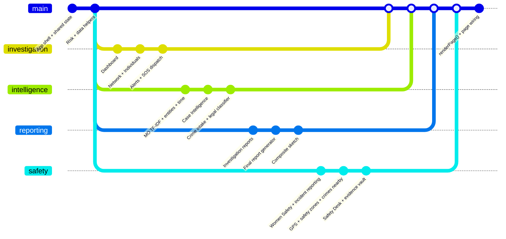
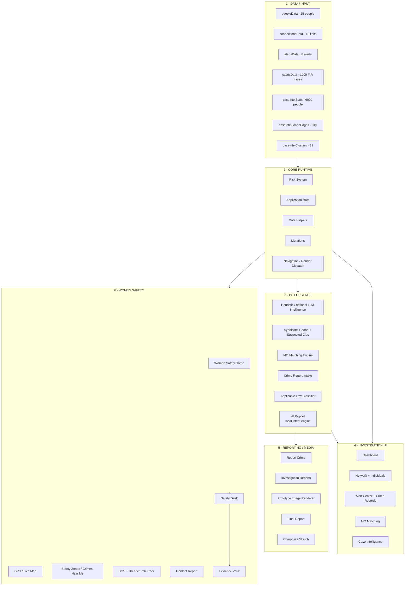
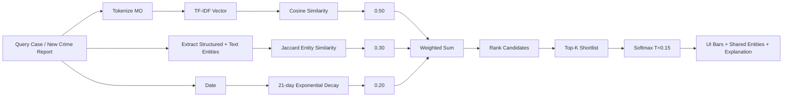
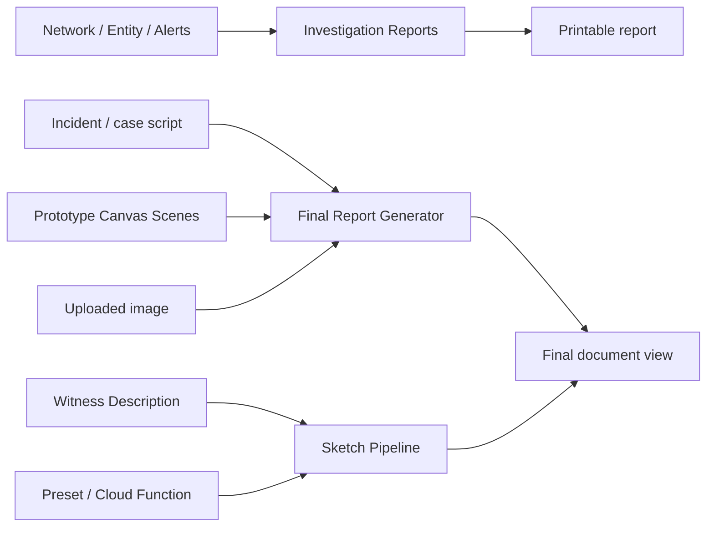
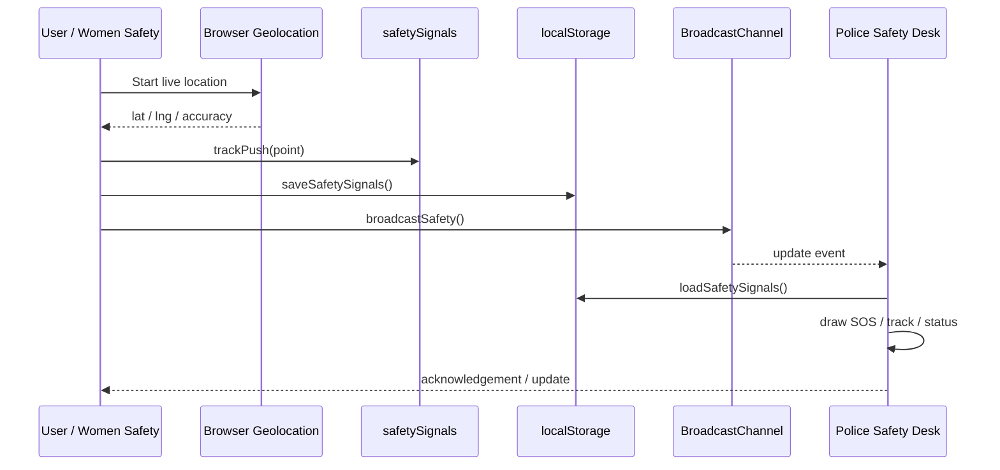
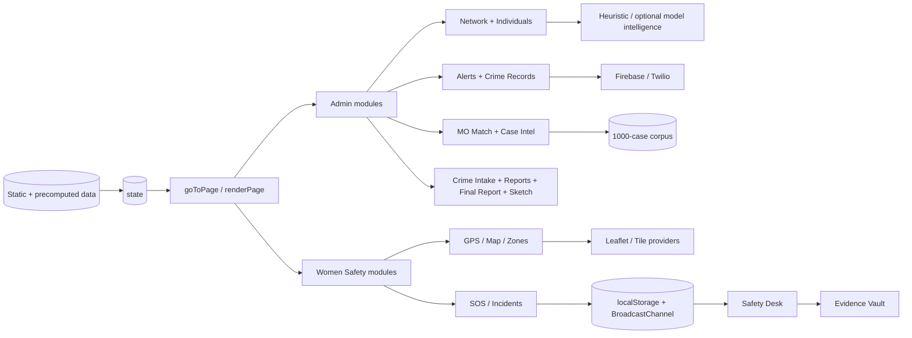

# CHAKRA_KAVACH — Architecture, Code Map & Git-Style Documentation

> **Source audited:** `indexA__1_.html`  
> **Application title:** *CHAKRA_KAVACH — Intelligence Network Analysis & Investigation Platform*  
> **Source size:** 13,923 lines, single-file HTML/CSS/JavaScript application  
> **Purpose of this document:** reconstruct the **actual implemented architecture** from the source, show the runtime/data flows, document the matching and safety pipelines, and provide a Git-style module map that can be used directly in a GitHub repository.

---

## 1. Executive architecture

The application is a **client-heavy single-page application**. `state` is the central in-memory source of UI state; `goToPage()` updates `state.page`; `renderPage()` dispatches to the appropriate page renderer and then attaches page-specific wiring. The source contains both **administrator/investigation** features and a **women-safety user view**, with role gating performed in the browser.

```mermaid
flowchart LR
    A[Login / Role Selection] --> B[(Application State\nstate)]
    B --> C[goToPage()]
    C --> D{renderPage()}

    D --> D1[Dashboard]
    D --> D2[Network]
    D --> D3[Alert Center]
    D --> D4[MO Matching]
    D --> D5[Case Intelligence]
    D --> D6[Report Crime]
    D --> D7[Investigation Reports]
    D --> D8[Final Report]
    D --> D9[Sketch]
    D --> D10[Women Safety]
    D --> D11[Crimes Near Me]
    D --> D12[Women Safety Desk]

    E[(peopleData / connectionsData / alertsData)] --> B
    F[(casesData: 1000 cases)] --> M[MO Similarity Engine]
    G[(Precomputed Case Intel\n949 edges / 31 clusters)] --> D5
    H[(localStorage\nSOS / incidents / evidence)] --> B

    M --> D4
    M --> D6
    I[Risk + Clue + Syndicate Analysis] --> D1
    I --> D2

    D10 --> J[GPS + Safety Zones + SOS]
    J --> K[BroadcastChannel / localStorage]
    K --> D12

    L[Leaflet / OSM / Map tiles] --> J
    N[Firebase / Twilio bridge] -. optional .-> D3
    O[Anthropic-compatible endpoint] -. optional fallback .-> I
    P[Sketch Cloud Function] -. optional .-> D9

    classDef core fill:#0d1626,stroke:#4c8dff,color:#e8edf9,stroke-width:2px;
    classDef data fill:#101c33,stroke:#22d3ee,color:#e8edf9;
    classDef safety fill:#0f2a25,stroke:#34d399,color:#e8edf9;
    classDef ext fill:#2a1d12,stroke:#f5a524,color:#e8edf9;
    class A,B,C,D,D1,D2,D3,D4,D5,D6,D7,D8,D9 core;
    class E,F,G,H data;
    class D10,D11,D12,J,K safety;
    class L,N,O,P ext;
```

---

## 2. Git-style logical branch diagram

This `gitGraph` is a **logical architecture map, not the repository's historical commit log**. It treats major feature families as branches that converge through the common state/router shell.



---

## 3. Source-level module rail



---

## 4. Page router and render map

| Route key | UI page | Primary renderer | Primary post-render wiring | Audience |
|---|---|---|---|---|
| `dashboard` | Dashboard | `renderDashboard()` | `wireDashboard()` | Admin |
| `network` | Network + Individuals | `renderNetworkPage()` | `wireNetworkPage()` | Admin |
| `alerts` | Alert Center | `renderAlertsPage()` | `wireAlertsPage()` | Admin |
| `momatch` | MO Matching | `renderMOMatchPage()` | `wireMOMatchPage()` | Admin |
| `caseintel` | Case Intelligence | `renderCaseIntelPage()` | `wireCaseIntelPage()` | Admin |
| `reportcrime` | Report a Crime | `renderReportCrimePage()` | `wireReportCrimePage()` | Admin |
| `reports` | Investigation Reports | `renderReportsPage()` | `wireReportsPage()` | Admin |
| `finalreport` | Final Report | `renderFinalReportPage()` | `wireFinalReportPage()` | Admin |
| `sketch` | Sketch | `renderSketchPage()` | `wireSketchPage()` | Admin |
| `safety` | Women Safety | `renderSafetyPage()` | `wireSafetyPage()` | User |
| `crimesnearme` | Crimes Near Me | `renderCrimesNearMePage()` | rendered from safety data | User |
| `safetydesk` | Women Safety Desk | `renderSafetyDeskPage()` | `wireSafetyDeskPage()` | Admin |

A user-session request for an admin route is redirected to `safety`. The shell also updates counters, active navigation, the safety banner, the AI/copilot panel, and page-enter animation after dispatch.

---

## 5. Data inventory recovered from the source

| Data object | Observed size / role | Used by |
|---|---:|---|
| `peopleData` | 25 entities | Dashboard, Network, Individuals, AI/clues |
| `connectionsData` | 18 relationship edges | Network, degree/risk clues, AI |
| `alertsData` | 8 alerts | Dashboard, Alert Center, heuristic analysis |
| `casesData` | **1000 cases** | MO Matching, Case Intelligence, Report Crime matching |
| `caseIntelStats` | 1000 cases / 6000 people | Case Intelligence summary |
| `caseIntelGraphEdges` | 949 case-case edges | Temporal/case relationship graph |
| `caseIntelClusters` | 31 clusters; 73 cases in clusters; largest 8 | Serial-pattern candidate display |
| `activitySeries` | 15 deterministic activity points | Dashboard activity chart |
| `crimeRecordsData` | 10 records | Alert Center crime dataset view |
| `policeStationsData` | 120 stations | SOS routing / station selection |
| `sosContacts` | 3 initial contacts | Emergency dispatch UI |
| `LEGAL_SECTIONS` | rule catalogue | Applicable-law first-pass classifier |
| `CRIMES_NEAR_ME` | locality safety records | Women Safety / nearby crime view |
| `LOCATION_SAFETY_DATA` | locality risk records | Local AI copilot / safety context |

> **Source inconsistency:** a comment in the MO engine still says “300 cases”, but the embedded statistics and actual dataset are for **1000 cases**. Documentation should use 1000 unless the dataset is later changed.

---

## 6. Core state model

The application uses one central `state` object rather than a framework store. Its important branches are:

```text
state
├── page
├── selectedPersonId
├── network
│   ├── zoom / pan / filters / search
│   └── case / roster / selection state
├── individuals
├── alerts
├── records
├── sos
├── ai
│   ├── dashboard
│   └── suspected-clue state
├── reports
├── moMatch
├── caseIntel
├── reportCrime
├── safety
│   ├── GPS / tracking / follow
│   └── map state
├── incidentReports
├── desk
│   └── evidence
├── copilot
├── safetyAI
├── session
└── viewAs
```

**Runtime pattern:** data arrays + `state` → `render*()` → HTML → `wire*()` → user action → mutation/state update → selective rerender or `renderAll()`.

---

## 7. Risk and clue intelligence

### Risk bands

```text
81–100  → CRITICAL
61–80   → HIGH
31–60   → MEDIUM
0–30    → LOW
```

### Suspected-clue fallback score

The heuristic clue engine computes a composite entity score:

```text
suspect_score = risk + 4 × degree + 15 × unresolved_critical_alerts
```

It then uses the highest-scoring entity, strongest observed relationship, same-crime-category counts, and a bounded confidence heuristic. An optional model-backed path is attempted, with the heuristic intended as the fallback.

---

## 8. MO Matching — implemented algorithm

The source is explicit that the browser implementation is **not a trained temporal graph neural network**. It is an explainable scoring pipeline.

### 8.1 Entity extraction

`getCaseEntities()` / `extractMOEntities()` combine structured values and text-derived mentions including:

- main crime / subcrime
- weapon
- force
- toxin
- organisation
- district
- priority
- action/approach phrases from modus-operandi text

### 8.2 TF-IDF semantic similarity

For each case document:

```math
\mathrm{tfidf}(t,d)=\mathrm{tf}(t,d)\,\log\left(\frac{N+1}{\mathrm{df}(t)+1}\right)+\mathrm{tf}(t,d)
```

The code stores sparse vectors and norms, then computes cosine similarity:

```math
S_{MO}(a,b)=\frac{\mathbf v_a\cdot\mathbf v_b}{\lVert\mathbf v_a\rVert_2\lVert\mathbf v_b\rVert_2}
```

### 8.3 Entity overlap

```math
S_E(A,B)=\frac{|A\cap B|}{|A\cup B|}
```

### 8.4 Temporal proximity

With the default half-life of 21 days:

```math
S_T=\exp\left(-\frac{|\Delta d|\ln 2}{21}\right)
```

### 8.5 Fused match score

The actual source weights are:

```math
S = 0.50S_{MO}+0.30S_E+0.20S_T
```

The shortlist is sorted by `S`, and an attention-like normalized display weight is computed using softmax with temperature `0.15`:

```math
\alpha_i=\frac{\exp(S_i/0.15)}{\sum_j\exp(S_j/0.15)}
```

This same corpus index can vectorize a freshly submitted ad-hoc crime report without rebuilding the full index.



---

## 9. Case Intelligence pipeline

The source imports precomputed output attributed to `nlp_pipeline.py`:

```text
1000 cases
   │
   ├─ corpus-wide statistics
   ├─ k-NN case relationship graph
   │    └─ 949 weighted edges
   └─ connected components / stricter clusters
        ├─ 31 clusters
        ├─ 73 cases in clusters
        └─ largest cluster = 8 cases
```

The Case Intelligence page renders temporal graph geometry, distribution bars, score statistics, and cluster cards. It should be documented as a **precomputed graph layer plus client-side visualization**, not as a browser-trained ML model.

---

## 10. Crime-report intake flow

```mermaid
flowchart TD
    A[Officer submits crime type + evidence + information] --> B[buildAdHocReportCase()]
    B --> C[vectorizeAgainstCorpus()]
    B --> D[getCaseEntities()]
    C --> E[computeAdHocMatches()]
    D --> E
    E --> F[Rank similar historical cases]
    F --> G[inferProbableSyndicate()]
    F --> H[generateInvestigatorBrief()]
    B --> I[classifyOffence()]
    I --> J[Applicable-law suggestions]
    G --> K[Report Crime result]
    H --> K
    J --> K
    K --> L[Shared crime-report store / UI]
```

The law module is a **first-pass rules classifier**. It should remain advisory in documentation; source comments explicitly frame final booking as an officer decision.

---

## 11. Investigation UI branch

### Dashboard

Combines:

- KPI cards and risk distribution
- activity chart
- live risk bars
- crime/syndicate priority view
- high-alert-zone summary
- AI intelligence panel
- suspected-clue panel
- brief/crime list
- map with failure fallback

### Network

The graph supports:

- relationship types: `Communication`, `Financial`, `Meeting`, `Logistics`
- person risk coloring
- case-role overlays: suspect / witness / victim
- search, filters, zoom and pan
- selected-person inspector
- syndicate summary
- case roster
- embedded Individuals section

### Alert Center

Contains:

- severity/unread filters
- alert status mutation
- crime dataset records
- emergency SOS dispatch
- police-station routing
- SMS/WhatsApp/Twilio bridge logic
- Firebase status/dispatch hook

---

## 12. Reporting and media branch



The **prototype image renderer** is a canvas scene generator and post-processing system. The final-report flow maintains staged text/image state, edit controls, generation states, save state, and print output. The sketch module supports presets, parsed witness descriptions, a remote generation endpoint, and a pencil-frame transformation/fallback path.

---

## 13. Women Safety branch

### Shared SOS state

The safety feature keeps a common signal list and incident list in browser storage:

```text
SAFETY_KEY   = chakravyuh.safety.signals.v1
INCIDENT_KEY = chakravyuh.safety.incidents.v1
BUS          = chakravyuh.safety.bus.v1
```

`BroadcastChannel` is used as a same-browser live bridge, with `storage` events/polling as complementary synchronization.

### Breadcrumb tracking

- maximum stored points: `500`
- ping interval: `10,000 ms`
- a point is thinned if it arrives too soon and moves less than roughly `15 m`
- map layer shows current point, accuracy radius, trail, and optional auto-follow



### Safety UI

The branch includes:

- “I am unsafe” / SOS workflow
- Emergency SOS, being followed, harassment, unsafe area, medical help, threat of violence, other
- live location map and breadcrumb trail
- map-source fallback handling
- crimes-near-me view
- safety-zone bands and verdicts
- SOS map overlays
- incident reporting with image input
- emergency alert graph/timeline
- quick local AI/safety replies
- Safety Desk operator view
- evidence vault

---

## 14. Persistence & synchronization

| Store / channel | Key / mechanism | Purpose | Scope |
|---|---|---|---|
| Safety signals | `chakravyuh.safety.signals.v1` | SOS records + track + status | Browser storage |
| Safety incidents | `chakravyuh.safety.incidents.v1` | Incident reports | Browser storage |
| Safety bus | `chakravyuh.safety.bus.v1` | Live same-browser notifications | `BroadcastChannel` |
| Desk evidence | `chakravyuh.desk.evidence.v1` | Evidence records | Browser storage |
| Crime reports | capability-backed DB when available | submitted crime reports | optional shared backend capability |
| Firebase | Firestore `sos_alerts` hook | optional SOS/backend bridge | external |
| Twilio bridge | configurable HTTP endpoint | optional SMS/dispatch | external/local bridge |

> Browser storage and `BroadcastChannel` do **not** by themselves provide multi-device synchronization. Treat them as prototype/local synchronization unless a backend path is active.

---

## 15. External dependencies and integration points

| Integration | Purpose in source | Dependency mode |
|---|---|---|
| Leaflet 1.9.4 | safety/live/SOS maps | CDN with mirrors/fallback |
| OpenStreetMap / other tiles | basemap layers | network |
| Nominatim | reverse geocoding | network |
| Firebase / Firestore | optional SOS alert write | external |
| Twilio bridge | optional SMS/SOS dispatch | configurable endpoint |
| Anthropic-compatible Messages API | optional intelligence/explanation | **key empty by default; heuristic fallback** |
| Sketch Cloud Function | remote composite-sketch generation | external |
| Browser Geolocation | live safety tracking | browser permission |
| BroadcastChannel | tab-to-tab safety synchronization | browser |
| Canvas | prototype images / post-processing | browser |

---

## 16. Code review findings that should be fixed before production

These are observations from the **current source**, not changes silently applied by this document.

### 16.1 `ckSample()` self-recursion

At approximately source lines `3367–3371`, `ckSample()` calls `await ckSample()` from inside itself when a `claude.use` capability exists. That appears intended to acquire a capability (for example `claude.use("sample")`) but currently creates recursion. This can prevent the optional capability path from working as intended.

### 16.2 High-alert-zone severity casing mismatch

`getRiskLevel()` returns uppercase strings (`CRITICAL`, `HIGH`, ...), while `computeHighAlertZones()` compares against lowercase `"critical"` and `"high"` around source lines `3559–3561`. As written, those two counters do not increment from the risk-level result.

### 16.3 Dataset documentation mismatch

The MO engine comment says **300 cases**, but `caseIntelStats.totalCases` and the embedded dataset are **1000 cases**. Update the comment to avoid misleading maintainers.

### 16.4 Login is UI gating, not production authentication

`initLogin()` checks whether the identifier looks like an email/phone and whether the password has at least six characters, then creates a browser-side session object. No server-issued session/token is established by this routine.

### 16.5 Evidence digest is not a cryptographic hash

`deskHash()` is a deterministic DJB2-like 32-bit rolling function expanded to a 32-character display value. It can serve as a **prototype change/tamper indicator**, but should not be described as cryptographic evidence integrity. Production chain-of-custody should use a standard cryptographic hash such as SHA-256 plus immutable audit metadata.

### 16.6 Browser-side model key warning

The source itself warns that a browser-side model/API key is visible to developer tools. Keep the browser key empty and route model calls through a protected server-side proxy for production.

---

## 17. Recommended repository split

The application currently works as a monolithic HTML file. A maintainable Git repository could preserve behavior while splitting by the recovered module boundaries:

```text
chakra-kavach/
├── README.md
├── docs/
│   ├── architecture.md
│   ├── data-model.md
│   └── security-notes.md
├── public/
│   └── index.html
├── src/
│   ├── app/
│   │   ├── state.js
│   │   ├── router.js
│   │   ├── mutations.js
│   │   └── bootstrap.js
│   ├── data/
│   │   ├── people.js
│   │   ├── cases.js
│   │   ├── case-intel.js
│   │   └── legal-sections.js
│   ├── intelligence/
│   │   ├── risk.js
│   │   ├── clues.js
│   │   ├── mo-matching.js
│   │   ├── crime-intake.js
│   │   └── copilot.js
│   ├── pages/
│   │   ├── dashboard.js
│   │   ├── network.js
│   │   ├── alerts.js
│   │   ├── mo-match.js
│   │   ├── case-intel.js
│   │   ├── reports.js
│   │   ├── final-report.js
│   │   ├── sketch.js
│   │   ├── safety.js
│   │   └── safety-desk.js
│   ├── safety/
│   │   ├── gps.js
│   │   ├── sos.js
│   │   ├── zones.js
│   │   ├── evidence.js
│   │   └── sync.js
│   └── integrations/
│       ├── maps.js
│       ├── firebase.js
│       ├── twilio.js
│       ├── model-api.js
│       └── sketch-api.js
└── styles/
    ├── tokens.css
    ├── components.css
    └── pages.css
```

This tree is a **recommended refactor**, not a claim that the uploaded source is already split this way.

---

## 18. Runtime dependency map



---

## 19. Major source sections

| Source lines | Section |
|---:|---|
| 2866–3092 | Mock data / embedded datasets |
| 3093–3112 | Risk system |
| 3113–3206 | Application state |
| 3207–3244 | Data helpers |
| 3245–3484 | AI intelligence layer |
| 3485–3681 | Syndicate / zone / clue intelligence |
| 3682–3914 | MO similarity & matching engine |
| 3915–4053 | Crime report intake |
| 4054–4082 | Shared mutations |
| 4083–4170 | Navigation / render dispatch |
| 4183–4666 | Dashboard |
| 4667–5562 | Network + case roles |
| 5563–5865 | Individuals / person modal / add entity |
| 5866–6714 | Alerts / crime records / SOS dispatch |
| 6715–7156 | MO Match + Case Intelligence |
| 7157–7557 | Report Crime + applicable law |
| 7558–7964 | Investigation reports |
| 7965–8733 | Prototype image renderer / scenes |
| 8734–9937 | Final report generator |
| 9938–10747 | Composite sketch |
| 10748–12562 | Women Safety / GPS / zones / SOS / alert graph |
| 12563–12953 | Local AI Copilot |
| 12954–13764 | Safety Desk + Evidence Vault |
| 13765–13923 | Login / app bootstrap |

---

## 20. Named-function index

The following index is generated from the uploaded source so maintainers can jump from the documentation back to the monolithic file. Nested helper functions are included when they have a named `function` declaration.

### Risk System — 3 named functions

- `getRiskLevel()` — source line 3096
- `getRiskClass()` — source line 3102
- `riskColor()` — source line 3105

### Data Helpers — 9 named functions

- `getPersonById()` — source line 3210
- `getConnectionsForPerson()` — source line 3211
- `degreeOf()` — source line 3212
- `otherEnd()` — source line 3213
- `getAIFocusInfo()` — source line 3214
- `fmtTime()` — source line 3226
- `timeAgo()` — source line 3230
- `escapeHtml()` — source line 3238
- `initials()` — source line 3241

### AI Intelligence Layer — 4 named functions

- `generateIntelligenceAnalysis()` — source line 3257
- `ckSample()` — source line 3367
- `ask()` — source line 3376
- `generateLLMIntelligenceAnalysis()` — source line 3406

### Syndicate / Zone / Clue Intelligence — 5 named functions

- `computeSyndicateBreakdown()` — source line 3513
- `computeHighAlertZones()` — source line 3552
- `generateSuspectedCluesHeuristic()` — source line 3574
- `generateSuspectedClues()` — source line 3616
- `computeCaseRoster()` — source line 3669

### MO Similarity & Matching Engine — 14 named functions

- `getLocationStopwords()` — source line 3720
- `tokenizeMO()` — source line 3731
- `extractMOEntities()` — source line 3741
- `getCaseEntities()` — source line 3762
- `ensureMatchIndexes()` — source line 3781
- `vectorizeAgainstCorpus()` — source line 3813
- `cosineAdHoc()` — source line 3823
- `cosineSimMO()` — source line 3831
- `jaccardEntities()` — source line 3840
- `daysBetween()` — source line 3846
- `temporalProximity()` — source line 3847
- `softmax()` — source line 3850
- `computeCaseMatches()` — source line 3864
- `explainCaseMatchLLM()` — source line 3892

### Crime Report Intake — 6 named functions

- `buildAdHocReportCase()` — source line 3928
- `computeAdHocMatches()` — source line 3943
- `inferProbableSyndicate()` — source line 3970
- `generateInvestigatorBrief()` — source line 3991
- `getReportsDb()` — source line 4031
- `subscribeCrimeReports()` — source line 4036

### Mutations — 3 named functions

- `deletePerson()` — source line 4057
- `addPerson()` — source line 4068
- `setAlertStatus()` — source line 4078

### Navigation / Render Dispatch — 4 named functions

- `goToPage()` — source line 4102
- `renderAll()` — source line 4124
- `updateNavCounts()` — source line 4129
- `renderPage()` — source line 4141

### Toasts — 1 named functions

- `showToast()` — source line 4174

### Dashboard — 17 named functions

- `computeRiskDistribution()` — source line 4186
- `renderActivityChartSVG()` — source line 4192
- `renderRiskDistributionChart()` — source line 4219
- `renderLiveRiskChartSVG()` — source line 4248
- `wireLiveRiskChart()` — source line 4313
- `renderAIPanelContent()` — source line 4326
- `renderCrimeSyndicatePanelContent()` — source line 4356
- `renderHighAlertZonesPanelContent()` — source line 4380
- `renderSuspectClueContent()` — source line 4402
- `renderDashboard()` — source line 4437
- `dashboardBriefsHTML()` — source line 4570
- `renderDashboardBriefs()` — source line 4584
- `wireDashboard()` — source line 4589
- `wireCrimeMapFallback()` — source line 4602
- `runSuspectClueAnalysis()` — source line 4617
- `ensureSuspectClueAnalysis()` — source line 4636
- `runAIAnalysis()` — source line 4641

### Network — 4 named functions

- `getCaseColorMap()` — source line 4687
- `ensureLayout()` — source line 4709
- `networkVisiblePeopleIds()` — source line 4765
- `renderGraphLegendRiskHTML()` — source line 4784

### Case Roles on Graph — 19 named functions

- `graphCaseRoles()` — source line 4828
- `renderNetworkSVG()` — source line 4854
- `renderInspectorPanel()` — source line 5010
- `buildSyndicateSummary()` — source line 5109
- `rankMetaFor()` — source line 5172
- `renderSyndicateBox()` — source line 5181
- `wireSyndicateBox()` — source line 5258
- `renderCaseRosterPanel()` — source line 5267
- `wireCaseRoster()` — source line 5324
- `reRenderRosterOnly()` — source line 5342
- `renderNetworkPage()` — source line 5347
- `reRenderGraphOnly()` — source line 5447
- `reRenderInspectorOnly()` — source line 5459
- `reRenderSyndicateOnly()` — source line 5463
- `selectPerson()` — source line 5468
- `wireInspectorActions()` — source line 5479
- `wireGraphInteractions()` — source line 5495
- `setGraphZoom()` — source line 5516
- `wireNetworkPage()` — source line 5523

### Individuals — 5 named functions

- `getFilteredSortedPeople()` — source line 5566
- `renderIndividualsSection()` — source line 5584
- `reRenderIndividualsOnly()` — source line 5687
- `wireIndividualsSection()` — source line 5694
- `refocus()` — source line 5738

### Person Profile Modal — 2 named functions

- `openPersonModal()` — source line 5746
- `closeModal()` — source line 5802

### Add Entity Modal — 1 named functions

- `openAddEntityModal()` — source line 5807

### Alerts / SOS / Crime Records — 31 named functions

- `getFilteredAlerts()` — source line 5871
- `renderAlertsPage()` — source line 5884
- `getFilteredCrimeRecords()` — source line 5916
- `crimeTypeTag()` — source line 5934
- `renderCrimeRecordsRTSBar()` — source line 5939
- `renderCrimeRecordsPage()` — source line 5980
- `computeAlertsRTS()` — source line 6047
- `renderAlertsRTSBar()` — source line 6065
- `renderAlertsListPage()` — source line 6099
- `getPoliceAreas()` — source line 6168
- `getStationsForArea()` — source line 6171
- `getStationById()` — source line 6174
- `ensureSosStationDefaults()` — source line 6177
- `policeStationContacts()` — source line 6189
- `getTwilioEndpoint()` — source line 6204
- `setTwilioEndpoint()` — source line 6208
- `sendSosViaTwilio()` — source line 6212
- `digitsOnly()` — source line 6253
- `maskPhone()` — source line 6260
- `buildSosMessage()` — source line 6269
- `renderSosPage()` — source line 6286
- `twilioStatusBannerHTML()` — source line 6432
- `firebaseStatusBannerHTML()` — source line 6451
- `twilioResultFor()` — source line 6460
- `renderSosDispatch()` — source line 6465
- `wireAlertsPage()` — source line 6495
- `wireSosPage()` — source line 6520
- `wireCrimeRecordsPage()` — source line 6612
- `reRenderSosDispatchOnly()` — source line 6626
- `triggerSos()` — source line 6634
- `openAddContactModal()` — source line 6677

### MO Matching UI — 12 named functions

- `momatchFilteredCases()` — source line 6720
- `renderCaseListPanel()` — source line 6730
- `fmtDateOnly()` — source line 6756
- `renderCaseDetailAndMatches()` — source line 6761
- `renderMOMatchResults()` — source line 6811
- `renderMatchRow()` — source line 6826
- `renderMOMatchPage()` — source line 6855
- `wireMOMatchPage()` — source line 6870
- `wireCaseListClicks()` — source line 6887
- `reRenderCaseListOnly()` — source line 6898
- `runMOMatch()` — source line 6903
- `runExplainMatch()` — source line 6921

### Case Intelligence UI — 9 named functions

- `crimeColor()` — source line 6962
- `parseDateStr()` — source line 6963
- `computeTemporalGraphLayout()` — source line 6966
- `renderTemporalGraphSVG()` — source line 6990
- `ciBarRows()` — source line 7035
- `renderCaseIntelStats()` — source line 7046
- `renderCaseIntelClusters()` — source line 7084
- `renderCaseIntelPage()` — source line 7111
- `wireCaseIntelPage()` — source line 7134

### Report Crime UI — 4 named functions

- `renderReportCrimeForm()` — source line 7160
- `renderReportCrimeResult()` — source line 7193
- `reportCrimeReportsListHTML()` — source line 7216
- `renderReportCrimeReportsList()` — source line 7240

### Applicable Law — 6 named functions

- `classifyOffence()` — source line 7410
- `legalSectionLabel()` — source line 7432
- `renderLegalSectionsHTML()` — source line 7434
- `renderReportCrimePage()` — source line 7462
- `wireReportCrimePage()` — source line 7499
- `handleReportCrimeSubmit()` — source line 7505

### Reports — 20 named functions

- `nextReportId()` — source line 7563
- `getReportById()` — source line 7568
- `buildNetworkReportContent()` — source line 7570
- `buildEntityReportContent()` — source line 7585
- `buildAlertsReportContent()` — source line 7604
- `buildReportContent()` — source line 7612
- `defaultReportTitle()` — source line 7618
- `createReport()` — source line 7624
- `regenerateReport()` — source line 7641
- `deleteReportById()` — source line 7652
- `ensureDefaultReport()` — source line 7658
- `renderReportsPage()` — source line 7664
- `renderReportsList()` — source line 7674
- `renderReportCard()` — source line 7698
- `renderReportDetail()` — source line 7731
- `renderNetworkReportBody()` — source line 7768
- `renderEntityReportBody()` — source line 7822
- `renderAlertsReportBody()` — source line 7859
- `wireReportsPage()` — source line 7885
- `openNewReportModal()` — source line 7906

### Prototype Image Renderer — 27 named functions

- `rng()` — source line 7977
- `lin()` — source line 7987
- `rrect()` — source line 7992
- `glow()` — source line 7996
- `rot()` — source line 8006
- `font()` — source line 8007
- `vignette()` — source line 8010
- `rain()` — source line 8015
- `scanlines()` — source line 8023
- `tint()` — source line 8028
- `cctv()` — source line 8031
- `bbox()` — source line 8051
- `marker()` — source line 8061
- `watermark()` — source line 8074
- `label()` — source line 8085
- `mat()` — source line 8095
- `ruler()` — source line 8106
- `tag()` — source line 8118
- `baseMap()` — source line 8127
- `river()` — source line 8140
- `compass()` — source line 8153
- `scaleBar()` — source line 8161
- `pin()` — source line 8166
- `truckSide()` — source line 8176
- `truckRear()` — source line 8196
- `policeCar()` — source line 8217
- `crate()` — source line 8232

### Prototype Scenes — 4 named functions

- `parseModifiers()` — source line 8678
- `postProcess()` — source line 8688
- `render()` — source line 8711
- `stamp()` — source line 8725

### Final Report Generator — 50 named functions

- `frSimulateStream()` — source line 8886
- `frKey()` — source line 8900
- `frNewSlot()` — source line 8901
- `frState()` — source line 8912
- `frIsSaved()` — source line 8927
- `frTextStale()` — source line 8928
- `frExampleProgress()` — source line 8932
- `frDescribeEdit()` — source line 8939
- `frCaption()` — source line 8959
- `frGenerate()` — source line 8966
- `frMarkSaved()` — source line 8996
- `frSave()` — source line 9000
- `frRewriteText()` — source line 9011
- `frSaveText()` — source line 9041
- `frPrintFinal()` — source line 9054
- `frGenerateAll()` — source line 9062
- `frUploadImage()` — source line 9071
- `frStatusBadge()` — source line 9107
- `frLoaderHTML()` — source line 9115
- `frUpdateLoader()` — source line 9136
- `frStageHTML()` — source line 9147
- `frPromptHTML()` — source line 9164
- `frClueKeywords()` — source line 9213
- `frCluePhrases()` — source line 9218
- `frClueScore()` — source line 9228
- `frClueUpdate()` — source line 9236
- `frImageActions()` — source line 9265
- `frStepsHTML()` — source line 9285
- `frTextBoxHTML()` — source line 9311
- `frImageBoxHTML()` — source line 9373
- `frGalleryHTML()` — source line 9390
- `frFinalDocHTML()` — source line 9418
- `renderFinalReportPage()` — source line 9495
- `frHydrateImages()` — source line 9564
- `wireFinalReportPage()` — source line 9574
- `frRefresh()` — source line 9592
- `frHandleClick()` — source line 9608
- `frOpenEditor()` — source line 9660
- `loadImage()` — source line 9730
- `buildBase()` — source line 9733
- `previewFilter()` — source line 9745
- `layout()` — source line 9748
- `setAspect()` — source line 9768
- `drawBox()` — source line 9780
- `valid()` — source line 9788
- `resetControls()` — source line 9846
- `applyEdits()` — source line 9854
- `onKey()` — source line 9898
- `onResize()` — source line 9899
- `close()` — source line 9900

### Composite Sketch — 24 named functions

- `playPresetSketch()` — source line 10042
- `requestAiSketch()` — source line 10060
- `toPencilFrame()` — source line 10093
- `skState()` — source line 10117
- `skAllDefs()` — source line 10122
- `skDef()` — source line 10123
- `skSortOrder()` — source line 10124
- `skGenerate()` — source line 10129
- `skCreateCustom()` — source line 10157
- `skRefresh()` — source line 10179
- `skUpdateLoader()` — source line 10183
- `skErrorHTML()` — source line 10194
- `skCardHTML()` — source line 10212
- `renderSketchPage()` — source line 10274
- `wireSketchPage()` — source line 10312
- `skChipsPreviewHTML()` — source line 10322
- `skOpenDialog()` — source line 10332
- `skUpdateCustom()` — source line 10498
- `skFinalDocHTML()` — source line 10530
- `parseDescription()` — source line 10559
- `skFeatureChips()` — source line 10668
- `skHairPhrase()` — source line 10697
- `skTitleFor()` — source line 10704
- `skAboutFor()` — source line 10713

### Women Safety SOS — 21 named functions

- `metresBetween()` — source line 10774
- `trackPoint()` — source line 10780
- `trackPush()` — source line 10781
- `trackLatLngs()` — source line 10789
- `loadSafetySignals()` — source line 10791
- `saveSafetySignals()` — source line 10798
- `loadIncidentReports()` — source line 10807
- `saveIncidentReports()` — source line 10814
- `broadcastSafety()` — source line 10831
- `onSafetyChanged()` — source line 10844
- `openSafetySignals()` — source line 10849
- `safetySignalById()` — source line 10850
- `currentRole()` — source line 10851
- `mySafetySignal()` — source line 10852
- `safetyStatusLabel()` — source line 10857
- `safetyStatusClass()` — source line 10860
- `safetyReasonLabel()` — source line 10863
- `addSafetyUpdate()` — source line 10865
- `raiseSafetySignal()` — source line 10870
- `safetyLocate()` — source line 10898
- `mapsLink()` — source line 10914

### Safety UI / Crimes Near Me / GPS — 6 named functions

- `renderSafetyMascot()` — source line 10921
- `cnmHeatClass()` — source line 11301
- `cnmDate()` — source line 11302
- `crimesNearMeTotal()` — source line 11309
- `renderCrimesNearMeBody()` — source line 11316
- `renderCrimesNearMePage()` — source line 11359

### Safety Zones / Live Map / SOS Overlay — 51 named functions

- `zoneBandFor()` — source line 11425
- `safetyZones()` — source line 11427
- `zoneVerdict()` — source line 11440
- `drawSafetyZones()` — source line 11469
- `clearSafetyZones()` — source line 11494
- `renderZoneVerdictHTML()` — source line 11500
- `leafletReady()` — source line 11525
- `mapSourceIndex()` — source line 11578
- `mapSource()` — source line 11586
- `setMapSource()` — source line 11587
- `safetyTileLayer()` — source line 11592
- `mapWaitingHTML()` — source line 11613
- `geoInsecureContext()` — source line 11627
- `geoBlockNotice()` — source line 11635
- `liveMapFrame()` — source line 11661
- `tellLiveMap()` — source line 11662
- `acceptFix()` — source line 11670
- `safetyLiveLink()` — source line 11710
- `osmFallbackIframe()` — source line 11716
- `destroySafetyMap()` — source line 11723
- `initSafetyMap()` — source line 11729
- `setSafetyMapPoint()` — source line 11765
- `sosOverlaySignals()` — source line 11806
- `drawSosConsoleOverlay()` — source line 11814
- `drawSosAlertsOn()` — source line 11820
- `sosConsoleAlertsBlock()` — source line 11863
- `destroySosAlertMap()` — source line 11881
- `initSosAlertMap()` — source line 11886
- `sosOverlayShape()` — source line 11909
- `sosOverlayFixes()` — source line 11912
- `startSosOverlayPoll()` — source line 11916
- `reverseGeocodeSafety()` — source line 11927
- `updateLiveLocationUI()` — source line 11938
- `startLiveLocation()` — source line 11951
- `stopLiveLocation()` — source line 12014
- `shareLiveLocation()` — source line 12024
- `copyLiveLocation()` — source line 12036
- `wireSosHoldButton()` — source line 12047
- `draw()` — source line 12054
- `press()` — source line 12060
- `stop()` — source line 12067
- `wireSafetyPage()` — source line 12084
- `useLocalSafetyMap()` — source line 12102
- `renderSafetyPage()` — source line 12112
- `renderSafetyComposer()` — source line 12154
- `renderSafetyLiveCard()` — source line 12170
- `safetySeverityForReason()` — source line 12202
- `renderSafetyStatusCard()` — source line 12207
- `renderLiveLocationBox()` — source line 12237
- `renderSafetyContactsBox()` — source line 12287
- `renderSafetyAlertsBox()` — source line 12311

### Emergency Alert Graph — 8 named functions

- `alertTimelineStageStatus()` — source line 12366
- `renderAlertTimelineBox()` — source line 12377
- `renderIncidentReportBox()` — source line 12422
- `submitIncidentReport()` — source line 12483
- `clearIncidentDraft()` — source line 12508
- `handleIncidentImageUpload()` — source line 12513
- `getAISafetyReply()` — source line 12532
- `aiQuickAction()` — source line 12548

### AI Copilot — 13 named functions

- `copilotLocalityRecord()` — source line 12592
- `copilotFindLocation()` — source line 12601
- `detectCopilotIntent()` — source line 12625
- `copilotContext()` — source line 12647
- `getCopilotResponse()` — source line 12652
- `copilotMood()` — source line 12773
- `copilotGreeting()` — source line 12800
- `copilotProjectData()` — source line 12806
- `copilotSend()` — source line 12815
- `renderCopilotMount()` — source line 12834
- `renderCopilotPanel()` — source line 12891
- `renderAISafetyAssistant()` — source line 12907
- `renderSafetyHistory()` — source line 12933

### Safety Desk — 9 named functions

- `deskSelectedSignal()` — source line 12962
- `deskSignalList()` — source line 12967
- `deskReportList()` — source line 12973
- `deskSelectedReport()` — source line 12976
- `deskHash()` — source line 12981
- `deskEntities()` — source line 12994
- `deskSmsText()` — source line 13013
- `deskSmsRecipients()` — source line 13018
- `renderDeskBlockMap()` — source line 13026

### Evidence Vault — 22 named functions

- `loadDeskEvidence()` — source line 13127
- `saveDeskEvidence()` — source line 13133
- `deskAutoEvidence()` — source line 13138
- `deskAddedEvidence()` — source line 13149
- `deskEvidenceItems()` — source line 13154
- `sealEvidence()` — source line 13158
- `renderDeskEvidence()` — source line 13174
- `deskIntelAnswer()` — source line 13284
- `renderDeskIntelligence()` — source line 13323
- `renderSafetyDeskPage()` — source line 13348
- `deskChime()` — source line 13383
- `deskSignalPoints()` — source line 13400
- `deskDrawAlert()` — source line 13406
- `deskShape()` — source line 13442
- `deskFixes()` — source line 13446
- `deskStartPoll()` — source line 13450
- `deskRefreshPositions()` — source line 13462
- `wireSafetyDeskPage()` — source line 13474
- `updateSafetyBanner()` — source line 13530
- `updateSafetyNavCount()` — source line 13542
- `enterUserView()` — source line 13552
- `exitUserView()` — source line 13561

### Login / Bootstrap — 7 named functions

- `initLogin()` — source line 13768
- `setRole()` — source line 13778
- `startClock()` — source line 13878
- `tick()` — source line 13879
- `initNav()` — source line 13889
- `openSidebarMobile()` — source line 13906
- `closeSidebarMobile()` — source line 13910

---

## 21. Documentation legend

- **Blue** — core UI/router/investigation flow
- **Cyan** — data and render flow
- **Magenta/red** — intelligence, critical risk, alerts
- **Green** — women-safety/SOS branch
- **Orange** — external services/integrations
- Dashed arrows — optional or fallback integrations

---

*Generated by reading the current uploaded `indexA__1_.html`. If the HTML changes, regenerate this document so line references, counts, and module descriptions stay synchronized.*
